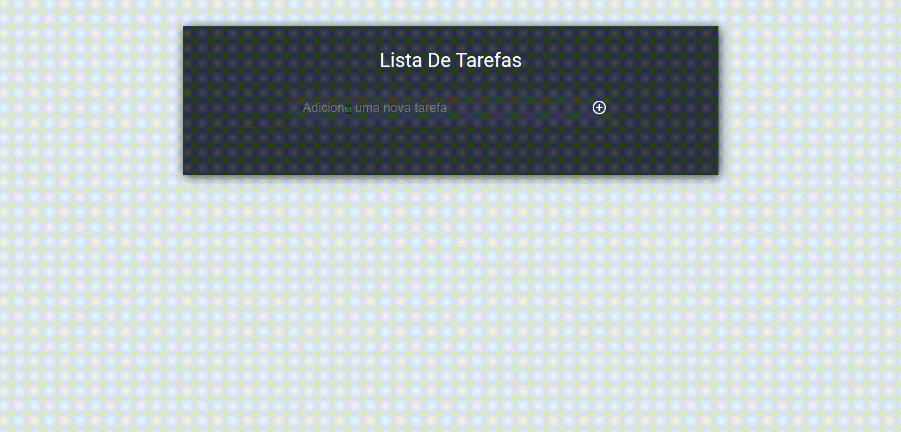

## Available Scripts

This project was bootstrapped with [Create React App](https://github.com/facebook/create-react-app).

### `yarn start`

Runs the app in the development mode. 
Open [http://localhost:3000](http://localhost:3000) to view it in the browser.

The page will reload if you make edits. 
You will also see any lint errors in the console.

## Lista de Tarefas

### Um projeto simples para a elaboração de uma lista de tarefas, permitindo a inclusão e a exclusão de itens

    

